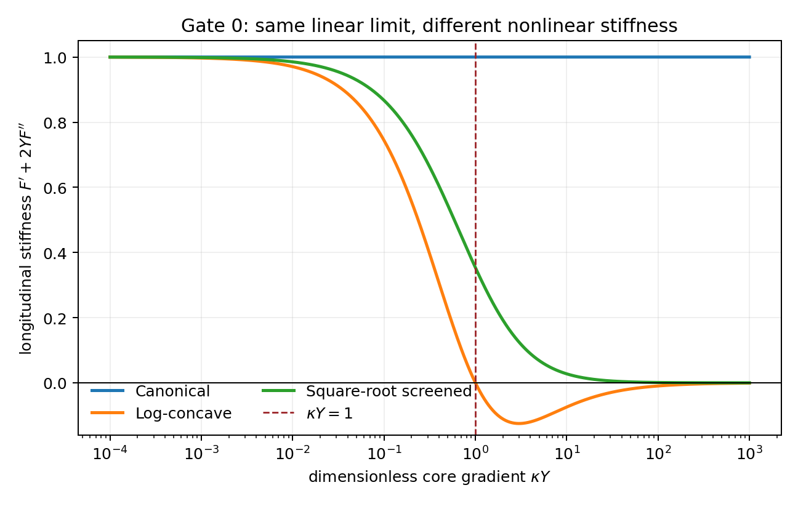
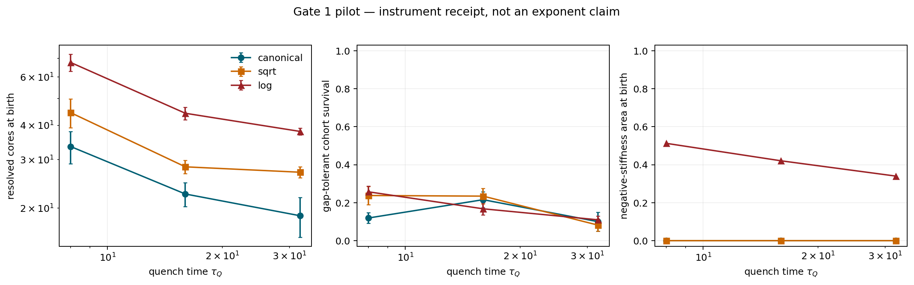

# Kdefect

**Do noncanonical defect cores change how vortices are born, or only how they survive?**

Kdefect is a deliberately narrow computational-physics project. It compares three
variational, two-dimensional U(1) field theories that have the same linear critical
dynamics but different nonlinear gradient response. The target is a clean separation
between Kibble–Zurek formation, core-scale motion and annihilation, and late spatial
statistics.

**Gate 2 is now a frozen negative result.** The present resolved-core observable has not
reached the preregistered grid/detector/time-step plateau, the logarithmic arm is
classified `LOG_ARM_REGULATOR_DEFINED_OR_UNRESOLVED`, and Gate 3 is not numerically
allowed. See [GATE2_RESULT.md](GATE2_RESULT.md) for the exact kill criteria and
[`results/gate2_convergence_freeze.json`](results/gate2_convergence_freeze.json) for a
machine-readable receipt. The GitHub Actions artifact used to freeze the result is
identified by run id, artifact id, SHA-256 digest, and source commit in both files, so
the result does not depend on an expiring signed artifact URL.

This is a falsification project, not a cosmology claim. The implemented equation is an
overdamped stochastic Model-A theory—a dissipative Euclidean cousin of relativistic
`k`-defect models, not a theory of gravity and not yet evidence for a new universality
class.

There is also a deliberate two-dimensional caveat: at nonzero temperature a strict
equilibrium U(1) model has Berezinskii–Kosterlitz–Thouless rather than ordinary
mean-field criticality. Here `epsilon=0` is the *bare Landau instability*, not a
numerically calibrated BKT point. The familiar `-1/2` density exponent is therefore a
reference hypothesis; Gate 3 would have required calibration of the finite-size
transition/crossover or a separately preregistered noise-seeded zero-temperature
protocol. Because Gate 2 failed numerical admissibility, that confirmatory Gate 3 was
not launched.

## The seam

Noncanonical kinetic terms are known to alter the size and energy of topological
defects ([Babichev 2006](https://doi.org/10.1103/PhysRevD.74.085004)) and their gauge
vortex counterparts ([Babichev 2008](https://doi.org/10.1103/PhysRevD.77.065021)).
Modern Kibble–Zurek work has moved beyond mean defect counts to full counting and
post-freeze-out dynamics
([Gluscevich & Sauls 2025](https://doi.org/10.1103/tlv7-bvkh)), and in 2026 to the
Poisson/Voronoi spatial geometry of quenched vortices
([Patra et al. 2026](https://doi.org/10.1038/s42005-026-02668-7),
[Patra, Comaron & Roy 2026](https://arxiv.org/abs/2606.24864)).

The open question tested here is at their intersection:

> If the long-wavelength instability is held fixed while only the nonlinear core law
> changes, is the Kibble–Zurek birth law unchanged even when survival and spatial
> organization diverge?

The current implementation does **not** establish that separation: Gate 2 found strong
numerical dependence of the resolved birth observable before the confirmatory scaling
question could be asked.

## One free energy, three arms

For a complex field `psi` on a periodic square, define

```math
\mathcal F[\psi;t]=\int d^2x\left[
\frac12 F(Y)+\frac g2|\nabla^2\psi|^2
-\frac{\epsilon(t)}2|\psi|^2+\frac u4|\psi|^4
\right],\qquad Y=|\nabla\psi|^2 .
```

All simulations use stochastic gradient flow,

```math
\partial_t\psi=\nabla\!\cdot\!\left[F'(Y)\nabla\psi\right]
+\epsilon(t)\psi-u|\psi|^2\psi-g\nabla^4\psi+\eta,
```

with a linear quench of `epsilon` through zero and fluctuation–dissipation noise.
The lattice force is the exact negative gradient of the *discrete* energy because its
forward differences and flux divergence are an adjoint pair.

| arm | gradient energy `F(Y)` | longitudinal stiffness `F' + 2YF''` | role |
|---|---|---|---|
| canonical | `Y` | `1` | Model-A reference |
| square-root | `2(sqrt(1+kappa Y)-1)/kappa` | `(1+kappa Y)^(-3/2)` | screened but elliptic core |
| logarithmic | `log(1+kappa Y)/kappa` | `(1-kappa Y)/(1+kappa Y)^2` | concave core; non-elliptic for `kappa Y>1` |

Each arm obeys `F(Y)=Y+O(Y^2)`, so its linearized transition is identical. The
logarithmic arm is intentionally dangerous: the fourth-order `g` term is an explicit
short-distance regulator. Any effect that follows `g` or the grid rather than reaching
a scaling plateau is classified as regulator-defined pattern selection, not new defect
universality. Kibble–Zurek behavior in fourth-order pattern-forming dynamics already
has precedent ([Galla & Moro 2003](https://doi.org/10.1103/PhysRevE.67.035101)); that
is why regulator dependence is a primary observable here.



## What is actually measured

The code keeps four concepts separate:

1. **Raw topology:** integer phase winding around a plaquette.
2. **Resolved birth:** winding plus a sub-plaquette zero of both real field components
   and a depressed core relative to its local ring.
3. **Worldline survival:** same-charge cores linked through periodic minimum-cost
   assignments with a declared speed cutoff.
4. **Spatial organization:** counting cumulants, charge-resolved low-`k` form factors,
   and nearest-neighbor distance from the 2D Poisson point-process law.

The small default pilot is an instrument check. The preregistered campaign, convergence
requirements, and kill conditions are in [PREREGISTRATION.md](PREREGISTRATION.md) and
[GATE2_CONVERGENCE_PROTOCOL.md](GATE2_CONVERGENCE_PROTOCOL.md).

## Gate 2 verdict

The completed convergence campaign returned:

```text
GATE2_PRIMARY_FAIL_OR_UNRESOLVED
LOG_ARM_REGULATOR_DEFINED_OR_UNRESOLVED
```

At fixed physical box size, `N=96 -> 128` changed canonical resolved birth density by
`23–38%` and square-root birth density by `39–41%`, versus a frozen `<5%` requirement.
Moving the resolved-core threshold changed birth density by about `10–14%` in every
numerical cell, again outside the `<5%` rule. Several `dt=.02 -> .01` checks also fail.

For the logarithmic arm, four of five regulator values fail the `<10%` grid-plateau
criterion for the paired log/canonical birth ratio. On the finest grid the predicted
core scale moves from `k*=1.359` to `0.714`, while the measured core-spectrum peak stays
at the same Fourier bin `k=0.523599`. The spectral tracking hypothesis therefore fails
rather than becoming evidence for a new regulator-independent scale.

The full result and claim boundary are frozen in [GATE2_RESULT.md](GATE2_RESULT.md).

## First receipts

Gate 0 passed: the worst numerical action/force mismatch is `1.14e-10`, and all three
gradient flows lower their declared lattice energy.

The paired `48^2`, four-seed pilot then produced the useful split the project was built
to detect:

- at `kappa=4`, the log arm never reaches negative stiffness (`max kappa*Y=0.586`), so
  that run is a pipeline baseline, not a test of the proposed mechanism;
- at exploratory `kappa=32`, log-arm resolved birth counts are about `1.97–2.03x`
  canonical, while the tiny-sample slope contrast is `0.002 [-0.194, 0.212]`;
- the larger late log population is **not** equivalent to survival of the birth cohort:
  `39–62%` of final cores are newly linked or reacquired even with a two-frame gap
  allowance;
- a one-grid regulator scout changes absolute birth counts in every arm. The
  log/canonical birth ratio spans about `14%` over `g=0.015–0.12`, so regulator
  independence was already not established before the larger Gate-2 kill test.

Those are exploratory leads and failure diagnostics, not discovery claims. Exact tables
and bootstrap intervals are in [RESULTS.md](RESULTS.md); complete machine-readable
records are under [`results/`](results/).



## Run it

Python 3.11 or newer is required.

```bash
python -m venv .venv
source .venv/bin/activate
python -m pip install -e '.[dev]'
pytest
python experiments/gate0_action_audit.py
python experiments/gate1_birth_survival.py
python experiments/gate2_regulator_scout.py
```

Every experiment writes a machine-readable JSON receipt under `results/` and a figure
under `figures/`. Seeds, numerical parameters, failed detections, effect estimates, and
claim boundaries are retained.

## Claim ledger

| statement | status |
|---|---|
| all arms are implemented as gradients of the declared lattice free energy | tested by Gate 0 |
| the logarithmic arm crosses zero longitudinal stiffness at `kappa Y=1` | analytic and tested by Gate 0 |
| winding detector resolves known synthetic cores and periodic worldlines | unit tested |
| noncanonical arms have the same vortex-birth exponent | **not established; Gate 3 blocked by Gate 2** |
| noncanonical cores change post-birth survival or spatial geometry | exploratory only; no converged claim |
| the logarithmic effect survives regulator/grid extrapolation | **failed / unresolved at Gate 2** |
| current resolved-core birth observable is grid/detector converged | **no** |
| any result applies to relativistic cosmology or gravity | **not claimed** |

## Repository map

```text
src/kdefect/laws.py        three nonlinear gradient laws
src/kdefect/lattice.py     discrete energy, exact variational force, noise step
src/kdefect/vortices.py    winding, bilinear cores, periodic worldlines
src/kdefect/quench.py      stochastic linear-quench protocol
src/kdefect/statistics.py  cumulants and spatial diagnostics
experiments/               executable gates
tests/                     action, topology, tracking, and statistic checks
results/                   immutable-style machine-readable receipts
```

## Origin

Kdefect starts from a useful failure found while auditing
[Arrowfield](https://github.com/anttiluode/Arrowfield) and
[Eromitta](https://github.com/anttiluode/Eromitta): a large vortex-count difference
was produced by a nonvariational Laplacian form, while the action-derived flux form had
a much smaller effect. Here, every comparison begins with the variational audit and an
explicit kill condition.

MIT licensed. Please cite the research papers above for their physics; this repository
does not replace them.