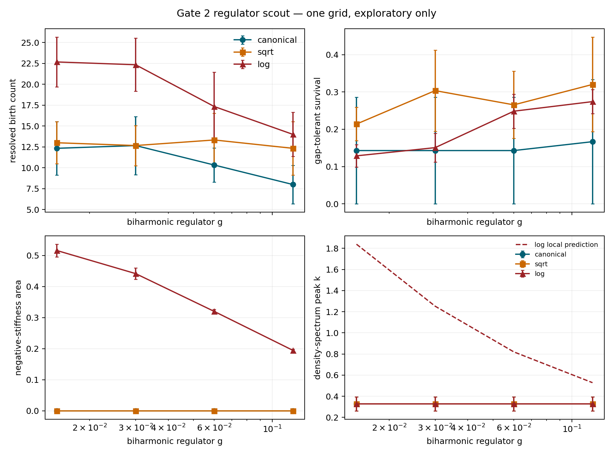

# Initial results ledger

Date: 2026-09-04. These are small computational receipts used to choose the real
campaign. They are not publication-level estimates.

## Gate 0 — passed

For every arm, a central finite-difference directional derivative of the discrete free
energy was compared with the inner product of the implemented force. The worst relative
error was `1.14e-10` (log arm), well inside the preregistered `1e-6` boundary. One small
deterministic gradient step lowered energy in all arms. The log stiffness changed sign
at exactly `kappa*Y=1`; canonical and square-root stiffness remained positive on the
scan.

Classification: `ACTION_DERIVED_ARMS_AND_STIFFNESS_BOUNDARIES_VERIFIED`.

This validates the implemented discretized variational identity. It says nothing yet
about universality.

## Gate 1 — weak-core paired pilot

Configuration: `48^2`, `dt=0.04`, `T=0.006`, `g=0.03`, `kappa=4`, four common-random-
number realizations per arm and quench time.

| arm | birth count, tau=8 | tau=16 | tau=32 | fitted slope, median [95% bootstrap] |
|---|---:|---:|---:|---:|
| canonical | 33.50 | 22.50 | 18.75 | -0.419 [-0.686, -0.163] |
| square-root | 33.25 | 23.75 | 21.25 | -0.331 [-0.614, -0.018] |
| logarithmic | 32.75 | 24.75 | 21.25 | -0.307 [-0.551, -0.045] |

Paired slope contrasts were `0.096 [-0.012, 0.189]` for square-root minus canonical and
`0.107 [-0.028, 0.252]` for log minus canonical. With three quench times, four seeds,
and no established scaling window these intervals are descriptive only.

The crucial diagnostic is negative: no log-arm site had negative longitudinal stiffness
at resolved birth. Its largest observed `kappa*Y` was `0.586`, below the boundary at
one. This pilot does not excite the proposed log-core mechanism.

## Gate 1b — strong-core exploratory scout

The same paired design was replayed at `kappa=32`. This parameter was chosen *after*
inspecting the weak-core receipt and is therefore explicitly exploratory.

```bash
python experiments/gate1_birth_survival.py --kappa 32 \
  --analysis-role exploratory_strong_core_scout \
  --output results/gate1b_strong_core_scout.json \
  --figure figures/gate1b_strong_core_scout.png
```

| arm | birth count, tau=8 | tau=16 | tau=32 | slope, median [95% bootstrap] |
|---|---:|---:|---:|---:|
| canonical | 33.50 | 22.50 | 18.75 | -0.419 [-0.686, -0.163] |
| square-root | 44.50 | 28.25 | 27.00 | -0.360 [-0.508, -0.204] |
| logarithmic | 67.75 | 44.25 | 38.00 | -0.415 [-0.505, -0.315] |

The log/canonical birth-count ratios from the cell means are `2.02`, `1.97`, and `2.03`.
Yet the paired log-minus-canonical slope contrast is only
`0.002 [-0.194, 0.212]`; square-root minus canonical is
`0.058 [-0.143, 0.257]`. A coherent possibility is a changed nonuniversal amplitude
with a shared birth exponent, but the sample is much too small to establish that.

The log arm occupies negative-stiffness fractions `0.513`, `0.421`, and `0.340` at
birth as the quench slows. Its late count ratios are larger than canonical, but lineage
tracking changes the interpretation:

| tau | log late-count / birth-count | log gap-tolerant birth-cohort survival | final cores newly linked or reacquired |
|---:|---:|---:|---:|
| 8 | 0.424 | 0.258 | 0.394 |
| 16 | 0.370 | 0.168 | 0.555 |
| 32 | 0.296 | 0.110 | 0.616 |

A late population is therefore not yet evidence for slowed annihilation. It may include
ongoing pair production from the negative-stiffness sector, missed-and-reacquired cores,
or both. The next run must increase cadence and preserve fields around every track break
to classify those events.

## Gate 2 — one-grid regulator scout

Configuration: `32^2`, `tau_Q=16`, `kappa=32`, three common seeds, one spatial and time
resolution. This is a confounder scout, not the preregistered convergence study.

| g | canonical birth | square-root birth | log birth | paired log/canonical ratio | log negative area | measured density peak k | local predicted k-star |
|---:|---:|---:|---:|---:|---:|---:|---:|
| 0.015 | 12.33 | 13.00 | 22.67 | 2.00 | 0.516 | 0.327 | 1.839 |
| 0.030 | 12.67 | 12.67 | 22.33 | 1.97 | 0.442 | 0.327 | 1.252 |
| 0.060 | 10.33 | 13.33 | 17.33 | 1.74 | 0.320 | 0.327 | 0.820 |
| 0.120 | 8.00 | 12.33 | 14.00 | 1.88 | 0.195 | 0.327 | 0.528 |



Absolute log birth counts span `45.4%` across `g`, but canonical counts also span
`43.1%`. The control-normalized log enhancement spans `14.0%`. Thus a multiplicity lead
survives this coarse scan, while regulator independence does not.

The measured density-spectrum peak is pinned near the lowest resolved shells and does
not track the local fastest-mode estimate. That may reject the simple finite-wavevector
story, or it may only show that a `32^2` density spectrum is dominated by vortex spacing
rather than core modulation. A larger grid and a core-conditioned gradient spectrum are
required before choosing between those explanations.

## Current decision

The supported result is methodological plus one concrete lead:

1. the three arms are genuinely action-derived and share their linearization;
2. strong nonlinear screening changes the resolved birth-count amplitude in this small
   model, with an approximately twofold log/canonical signal across the scout;
3. the exponent remains compatible with a shared value, but uncertainty is enormous;
4. “more vortices later” is not “better survival”—lineage ambiguity is large;
5. no regulator-independent, continuum, BKT-calibrated, or universal result exists yet.

Next decision: run Gate 2 at `L=64, 96, 128`, halve `dt`, use five `g` values, store
track-break neighborhoods, and measure a core-conditioned gradient spectrum. Only if a
control-normalized plateau appears should the 200-realization Gate 3 campaign begin.

The exact records are:

- [`results/gate0_action_audit.json`](results/gate0_action_audit.json)
- [`results/gate1_pilot.json`](results/gate1_pilot.json)
- [`results/gate1b_strong_core_scout.json`](results/gate1b_strong_core_scout.json)
- [`results/gate2_regulator_scout.json`](results/gate2_regulator_scout.json)
